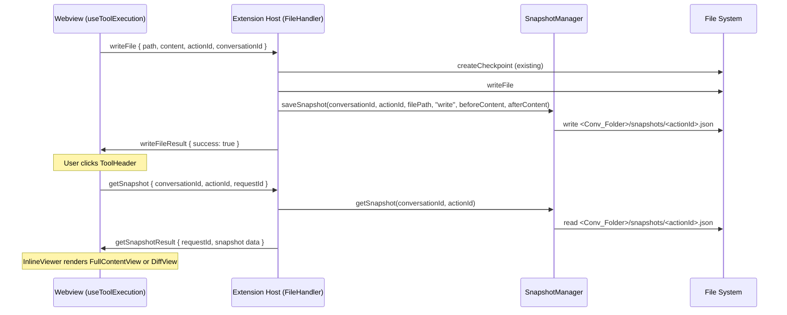

# Design Document: File Content Snapshot & Inline Diff Viewer

## Overview

Tính năng này bổ sung khả năng lưu trữ nội dung file tại thời điểm thực thi tool `write_to_file` / `replace_in_file`, sau đó cho phép người dùng xem lại nội dung đó trực tiếp trong conversation panel mà không cần mở editor. Khi click vào label **CREATE/REWRITE/UPDATE** trên `FileToolItem`, một `InlineViewer` sẽ mở ra ngay bên dưới, hiển thị toàn bộ nội dung file (với `write_to_file`) hoặc unified diff trước/sau (với `replace_in_file`).

### Luồng dữ liệu tổng quan



---

## Architecture

### Tổng quan kiến trúc

Tính năng được chia thành hai lớp chính:

**Extension Host (Node.js/TypeScript)**
- `SnapshotManager` — singleton mới, tương tự `CheckpointManager`, chịu trách nhiệm đọc/ghi snapshot files.
- `FileHandler` — được mở rộng với `handleGetSnapshot()` và tích hợp `SnapshotManager` vào `handleWriteFile()` / `handleReplaceInFile()`.
- `ChatController` — thêm `case "getSnapshot"` vào switch-case routing.

**Webview (React/TypeScript)**
- `useToolExecution` — truyền thêm `actionId` trong payload `writeFile` và `replaceInFile`.
- `FileToolItem` — thay đổi onClick logic, quản lý snapshot state, nhận thêm prop `conversationId`.
- `InlineViewer` — component mới, container cho `FullContentView` hoặc `DiffView`.
- `FullContentView` — hiển thị toàn bộ nội dung file với syntax highlighting (dùng `shiki` đã có sẵn).
- `DiffView` — hiển thị unified diff với màu đỏ/xanh, 3 context lines.

### Quyết định thiết kế

1. **SnapshotManager là singleton** — nhất quán với `CheckpointManager`, tránh tạo nhiều instance.
2. **Snapshot lưu `beforeContent` trước khi ghi** — `handleWriteFile` đọc nội dung file hiện tại trước khi ghi, tương tự cách `CheckpointManager.createCheckpoint` hoạt động.
3. **Snapshot file đặt tên theo `actionId`** — đảm bảo 1-1 mapping giữa tool action và snapshot, không cần index hay lookup table.
4. **Snapshot lưu sau khi ghi thành công** — không lưu nếu ghi thất bại, tránh snapshot không nhất quán với trạng thái file thực tế.
5. **Diff tính toán phía webview** — `beforeContent` và `afterContent` được gửi về webview, diff được tính bằng thuật toán LCS trong `DiffView`. Điều này tránh phải serialize diff phức tạp từ extension host và cho phép re-render linh hoạt.
6. **Syntax highlighting dùng `shiki`** — đã có sẵn trong `package.json`, không cần thêm dependency mới.
7. **Snapshot cleanup tự động** — `ConversationHandler` đã xóa toàn bộ `<Conv_Folder>/` khi delete conversation, nên snapshot trong `snapshots/` subdirectory sẽ được xóa tự động mà không cần thay đổi logic.

---

## Components and Interfaces

### 1. SnapshotManager (Extension Host)

**File:** `src/utils/SnapshotManager.ts`

```typescript
export interface Snapshot {
  filePath: string;
  operation: "write" | "replace";
  beforeContent: string | null;
  afterContent: string;
  timestamp: number;
}

export class SnapshotManager {
  private static instance: SnapshotManager;

  private constructor() {}

  public static getInstance(): SnapshotManager;

  private getSnapshotsDir(conversationId: string): string;
  // Returns: ~/khanhromvn-zen/projects/<md5hash>/<conversationId>/snapshots/

  public async saveSnapshot(
    conversationId: string,
    actionId: string,
    filePath: string,
    operation: "write" | "replace",
    beforeContent: string | null,
    afterContent: string,
  ): Promise<void>;
  // Writes <snapshotsDir>/<actionId>.json
  // Silently ignores errors (does not affect file write result)
  // Skips if filePath contains node_modules, .git, khanhromvn-zen

  public async getSnapshot(
    conversationId: string,
    actionId: string,
  ): Promise<Snapshot | null>;
  // Reads <snapshotsDir>/<actionId>.json
  // Returns null if file does not exist
}
```

**Ignore pattern** (nhất quán với `CheckpointManager`):
```typescript
const IGNORED_PATHS = [".git", "khanhromvn-zen", "node_modules", ".vscode"];
```

### 2. FileHandler — Thay đổi

**File:** `src/controllers/handlers/FileHandler.ts`

#### `handleWriteFile` — Thêm snapshot logic

```typescript
// Sau khi writeFile thành công (trước khi postMessage writeFileResult):
if (message.conversationId && message.actionId) {
  const beforeContent = fileExists
    ? await fs.promises.readFile(absolutePath.fsPath, "utf-8").catch(() => null)
    : null;
  // Note: beforeContent đã được đọc TRƯỚC khi ghi (fileExists check đã có sẵn)
  await SnapshotManager.getInstance().saveSnapshot(
    message.conversationId,
    message.actionId,
    absolutePath.fsPath,
    "write",
    beforeContent,
    message.content,
  );
}
```

> **Lưu ý quan trọng:** `beforeContent` phải được đọc **trước** khi `vscode.workspace.fs.writeFile()` được gọi. Trong code hiện tại, `fileExists` đã được check trước khi ghi — ta sẽ đọc nội dung cũ tại cùng điểm đó.

#### `handleReplaceInFile` — Thêm snapshot logic

```typescript
// Trong handleReplaceInFile, sau khi đọc content (biến `content`) và trước khi ghi newContent:
// beforeContent = content (đã có sẵn)
// Sau khi ghi thành công:
if (message.conversationId && message.actionId && newContent) {
  await SnapshotManager.getInstance().saveSnapshot(
    message.conversationId,
    message.actionId,
    absPath.fsPath,
    "replace",
    content,  // nội dung trước replace
    newContent, // nội dung sau replace
  );
}
```

#### `handleGetSnapshot` — Method mới

```typescript
public async handleGetSnapshot(message: any, webviewView: vscode.WebviewView): Promise<void> {
  try {
    const { conversationId, actionId, requestId } = message;
    if (!conversationId || !actionId) {
      throw new Error("conversationId and actionId are required");
    }
    const snapshot = await SnapshotManager.getInstance().getSnapshot(conversationId, actionId);
    if (!snapshot) {
      webviewView.webview.postMessage({
        command: "getSnapshotResult",
        requestId,
        error: "Snapshot not found",
      });
      return;
    }
    webviewView.webview.postMessage({
      command: "getSnapshotResult",
      requestId,
      actionId,
      filePath: snapshot.filePath,
      operation: snapshot.operation,
      beforeContent: snapshot.beforeContent,
      afterContent: snapshot.afterContent,
      timestamp: snapshot.timestamp,
    });
  } catch (e: any) {
    webviewView.webview.postMessage({
      command: "getSnapshotResult",
      requestId: message.requestId,
      error: e.message,
    });
  }
}
```

### 3. ChatController — Thay đổi

**File:** `src/controllers/ChatController.ts`

Thêm vào switch-case trong `handleMessage()`:

```typescript
case "getSnapshot":
  await this.fileHandler.handleGetSnapshot(message, webviewView);
  break;
```

### 4. useToolExecution — Thay đổi

**File:** `src/webview-ui/src/hooks/useToolExecution.ts`

Trong `executeSingleAction`, truyền `actionId` vào payload:

```typescript
// write_to_file case:
extensionService.postMessage({
  command: "writeFile",
  path: filePath,
  content: action.params.content,
  requestId,
  skipDiagnostics,
  bypassIgnore,
  conversationId: conversationIdRef?.current,
  actionId: action.actionId,  // 🆕 thêm actionId
});

// replace_in_file case:
extensionService.postMessage({
  command: "replaceInFile",
  path: filePath,
  diff: action.params.diff,
  requestId,
  skipDiagnostics,
  bypassIgnore,
  conversationId: conversationIdRef?.current,
  actionId: action.actionId,  // 🆕 thêm actionId
});
```

`action.actionId` đã được set trong `handleToolRequest` trước khi gọi `executeSingleAction`:
```typescript
const actionId = action.actionId || `${message.id}-action-${action._index}`;
// executeSingleAction được gọi với { ...action, actionId }
```

### 5. FileToolItem — Thay đổi

**File:** `src/webview-ui/src/components/ChatPanel/ChatBody/components/ToolActions/FileToolItem.tsx`

#### Props mới

```typescript
interface FileToolItemProps {
  // ... existing props ...
  conversationId?: string;  // 🆕 để gửi getSnapshot
}
```

#### State mới

```typescript
const [isViewerOpen, setIsViewerOpen] = React.useState(false);
const [snapshotData, setSnapshotData] = React.useState<SnapshotData | null>(null);
const [snapshotLoading, setSnapshotLoading] = React.useState(false);
const [snapshotError, setSnapshotError] = React.useState<string | null>(null);
```

#### onClick logic mới

```typescript
// Chỉ áp dụng cho write_to_file và replace_in_file
const isSnapshotTool = toolType === "write_to_file" || toolType === "replace_in_file";

const handleHeaderClick = () => {
  if (isPartial) return; // Không mở viewer khi đang streaming

  if (isSnapshotTool && isCompleted) {
    const newOpen = !isViewerOpen;
    setIsViewerOpen(newOpen);

    // Lazy load snapshot khi mở lần đầu
    if (newOpen && !snapshotData && !snapshotLoading) {
      loadSnapshot();
    }
  } else {
    // Fallback: mở file trong editor (hành vi cũ cho các tool khác)
    if (rawPath) {
      extensionService.postMessage({ command: "openFile", path: rawPath });
    }
  }
};

const loadSnapshot = () => {
  if (!conversationId || !actionId) return;
  setSnapshotLoading(true);
  setSnapshotError(null);

  const requestId = `snapshot-${Date.now()}-${Math.random()}`;
  extensionService.postMessage({
    command: "getSnapshot",
    conversationId,
    actionId,
    requestId,
  });

  messageDispatcher.register(
    requestId,
    (msg) => {
      setSnapshotLoading(false);
      if (msg.error) {
        setSnapshotError(msg.error);
      } else {
        setSnapshotData({
          filePath: msg.filePath,
          operation: msg.operation,
          beforeContent: msg.beforeContent,
          afterContent: msg.afterContent,
          timestamp: msg.timestamp,
        });
      }
    },
    10000,
    () => {
      setSnapshotLoading(false);
      setSnapshotError("Request timed out");
    },
  );
};
```

#### Render InlineViewer

```tsx
{isSnapshotTool && isViewerOpen && (
  <InlineViewer
    loading={snapshotLoading}
    error={snapshotError}
    snapshot={snapshotData}
    filePath={rawPath}
    onOpenFile={() => extensionService.postMessage({ command: "openFile", path: rawPath })}
  />
)}
```

### 6. InlineViewer (Component mới)

**File:** `src/webview-ui/src/components/ChatPanel/ChatBody/components/ToolActions/InlineViewer.tsx`

```typescript
interface SnapshotData {
  filePath: string;
  operation: "write" | "replace";
  beforeContent: string | null;
  afterContent: string;
  timestamp: number;
}

interface InlineViewerProps {
  loading: boolean;
  error: string | null;
  snapshot: SnapshotData | null;
  filePath: string;
  onOpenFile: () => void;
}
```

**Render logic:**
- `loading === true` → hiển thị spinner + "Loading snapshot..."
- `error !== null` → hiển thị error message + nút "Open in Editor"
- `snapshot.operation === "write"` → render `<FullContentView />`
- `snapshot.operation === "replace"` → render `<DiffView />`

### 7. FullContentView (Component mới)

**File:** `src/webview-ui/src/components/ChatPanel/ChatBody/components/ToolActions/FullContentView.tsx`

```typescript
interface FullContentViewProps {
  filePath: string;
  content: string;
  beforeContent: string | null; // null = CREATE, non-null = REWRITE
}
```

**Tính năng:**
- Header: tên file, số dòng, badge "CREATE" hoặc "REWRITE"
- Syntax highlighting dùng `shiki` (đã có trong project, xem `RichtextBlock`)
- Line numbers bên trái
- `max-height: 400px`, `overflow-y: auto`
- Font: `var(--vscode-editor-font-family, monospace)`

**Language detection từ file extension:**
```typescript
const getLanguage = (filePath: string): string => {
  const ext = filePath.split(".").pop()?.toLowerCase() || "";
  const map: Record<string, string> = {
    ts: "typescript", tsx: "tsx", js: "javascript", jsx: "jsx",
    py: "python", rs: "rust", go: "go", java: "java",
    css: "css", html: "html", json: "json", md: "markdown",
    // ...
  };
  return map[ext] || "text";
};
```

### 8. DiffView (Component mới)

**File:** `src/webview-ui/src/components/ChatPanel/ChatBody/components/ToolActions/DiffView.tsx`

```typescript
interface DiffViewProps {
  filePath: string;
  beforeContent: string;
  afterContent: string;
}
```

**Tính năng:**
- Header: tên file, `+X -Y` stats
- Unified diff với 3 context lines
- Dòng xóa: màu đỏ (`--vscode-gitDecoration-deletedResourceForeground`), prefix `-`
- Dòng thêm: màu xanh (`--vscode-gitDecoration-addedResourceForeground`), prefix `+`
- Dòng context: màu mặc định, prefix ` `
- `max-height: 400px`, `overflow-y: auto`
- Font: `var(--vscode-editor-font-family, monospace)`

**Diff algorithm:** LCS (Longest Common Subsequence) thuần TypeScript, không cần thêm library. Implement trong `DiffView.tsx` hoặc extend `diffUtils.ts`.

```typescript
// Unified diff với context lines
interface DiffLine {
  type: "added" | "removed" | "context" | "separator";
  content: string;
  lineNumBefore?: number;
  lineNumAfter?: number;
}

const computeUnifiedDiff = (
  before: string,
  after: string,
  contextLines: number = 3,
): DiffLine[]
```

---

## Data Models

### Snapshot File Schema

**Path:** `~/khanhromvn-zen/projects/<md5hash>/<conversationId>/snapshots/<actionId>.json`

```typescript
interface SnapshotFile {
  filePath: string;        // Absolute path của file được ghi
  operation: "write" | "replace";
  beforeContent: string | null;  // null nếu file chưa tồn tại (CREATE)
  afterContent: string;    // Nội dung đầy đủ sau khi ghi
  timestamp: number;       // Unix timestamp (ms)
}
```

**Ví dụ — write_to_file (CREATE):**
```json
{
  "filePath": "/home/user/project/src/utils/helper.ts",
  "operation": "write",
  "beforeContent": null,
  "afterContent": "export const helper = () => {};\n",
  "timestamp": 1735000000000
}
```

**Ví dụ — write_to_file (REWRITE):**
```json
{
  "filePath": "/home/user/project/src/utils/helper.ts",
  "operation": "write",
  "beforeContent": "export const helper = () => {};\n",
  "afterContent": "export const helper = (x: number) => x * 2;\n",
  "timestamp": 1735000001000
}
```

**Ví dụ — replace_in_file:**
```json
{
  "filePath": "/home/user/project/src/utils/helper.ts",
  "operation": "replace",
  "beforeContent": "export const helper = () => {};\n",
  "afterContent": "export const helper = (x: number) => x * 2;\n",
  "timestamp": 1735000002000
}
```

### Message Protocol

#### Request: `getSnapshot`

```typescript
{
  command: "getSnapshot";
  conversationId: string;
  actionId: string;        // Format: "<messageId>-action-<index>"
  requestId: string;       // Unique ID cho request/response matching
}
```

#### Response: `getSnapshotResult` (success)

```typescript
{
  command: "getSnapshotResult";
  requestId: string;
  actionId: string;
  filePath: string;
  operation: "write" | "replace";
  beforeContent: string | null;
  afterContent: string;
  timestamp: number;
}
```

#### Response: `getSnapshotResult` (error)

```typescript
{
  command: "getSnapshotResult";
  requestId: string;
  error: string;  // "Snapshot not found" | "conversationId and actionId are required" | ...
}
```

#### Extended: `writeFile` request (thêm `actionId`)

```typescript
{
  command: "writeFile";
  path: string;
  content: string;
  requestId: string;
  skipDiagnostics?: boolean;
  bypassIgnore?: boolean;
  conversationId?: string;
  actionId?: string;  // 🆕 "<messageId>-action-<index>"
}
```

#### Extended: `replaceInFile` request (thêm `actionId`)

```typescript
{
  command: "replaceInFile";
  path: string;
  diff: string;
  requestId: string;
  skipDiagnostics?: boolean;
  bypassIgnore?: boolean;
  conversationId?: string;
  actionId?: string;  // 🆕 "<messageId>-action-<index>"
}
```

### Directory Structure

```
~/khanhromvn-zen/
└── projects/
    └── <md5hash>/
        ├── <conversationId>.json          # Conversation log
        └── <conversationId>/
            ├── checkpoints/               # Existing CheckpointManager
            │   └── ckpt_<timestamp>_<hex>.json
            └── snapshots/                 # 🆕 SnapshotManager
                ├── <messageId>-action-0.json
                ├── <messageId>-action-1.json
                └── ...
```

---

## Error Handling

### Extension Host

| Tình huống | Hành vi |
|---|---|
| `conversationId` hoặc `actionId` thiếu trong `writeFile`/`replaceInFile` | Bỏ qua snapshot, không ảnh hưởng kết quả ghi file |
| `saveSnapshot` ném exception | Catch silently, log warning, không ảnh hưởng `writeFileResult`/`replaceInFileResult` |
| `getSnapshot` — file không tồn tại | Trả `getSnapshotResult` với `error: "Snapshot not found"` |
| `getSnapshot` — JSON parse error | Trả `getSnapshotResult` với `error: <message>` |
| Workspace folder không tồn tại | `getSnapshotsDir` ném Error, được catch trong `handleGetSnapshot` |
| File path chứa ignored patterns | `saveSnapshot` return sớm, không ghi file |

### Webview

| Tình huống | Hành vi |
|---|---|
| `isPartial === true` khi click | `handleHeaderClick` return sớm, không mở viewer |
| `conversationId` không có | `loadSnapshot` return sớm, không gửi request |
| `getSnapshotResult` trả error | `snapshotError` được set, `InlineViewer` hiển thị error UI |
| Request timeout (10s) | `snapshotError = "Request timed out"`, hiển thị error UI |
| `shiki` highlight thất bại | Fallback về plain text với `<pre>` |
| `beforeContent` null trong `DiffView` | Không nên xảy ra (operation "replace" luôn có beforeContent), nhưng nếu xảy ra thì treat as empty string |

---

## Testing Strategy

### Unit Tests

**SnapshotManager:**
- `saveSnapshot` tạo file đúng path với đúng content
- `saveSnapshot` tạo thư mục `snapshots/` nếu chưa tồn tại
- `saveSnapshot` bỏ qua khi path chứa `node_modules`, `.git`, `khanhromvn-zen`
- `saveSnapshot` không throw khi gặp lỗi I/O
- `getSnapshot` trả đúng data khi file tồn tại
- `getSnapshot` trả `null` khi file không tồn tại

**DiffView — `computeUnifiedDiff`:**
- Diff giữa hai chuỗi giống nhau → không có dòng added/removed
- Diff với thêm dòng → dòng mới có type "added"
- Diff với xóa dòng → dòng cũ có type "removed"
- Context lines: chỉ hiển thị 3 dòng xung quanh mỗi hunk
- Nhiều hunk cách xa nhau → có separator giữa các hunk

**FullContentView — `getLanguage`:**
- `.ts` → `"typescript"`, `.py` → `"python"`, `.json` → `"json"`
- Extension không nhận ra → `"text"`

### Property-Based Tests

Xem phần **Correctness Properties** bên dưới.

### Integration Tests

- `FileHandler.handleWriteFile` → snapshot được tạo đúng path
- `FileHandler.handleReplaceInFile` → snapshot có đúng `beforeContent` và `afterContent`
- `FileHandler.handleGetSnapshot` → trả đúng data từ file đã lưu
- Delete conversation → thư mục `snapshots/` bị xóa (thông qua `ConversationHandler`)

### E2E / Manual Tests

- Click CREATE label → InlineViewer mở với FullContentView
- Click UPDATE label → InlineViewer mở với DiffView
- Click lại → InlineViewer đóng
- Click khi đang streaming → không có gì xảy ra
- Snapshot không tồn tại → error UI với nút "Open in Editor"


---

## Correctness Properties

*A property is a characteristic or behavior that should hold true across all valid executions of a system — essentially, a formal statement about what the system should do. Properties serve as the bridge between human-readable specifications and machine-verifiable correctness guarantees.*

### Property 1: Snapshot Round-Trip Preserves All Fields

*For any* valid combination of `(conversationId, actionId, filePath, operation, beforeContent, afterContent)`, saving a snapshot via `SnapshotManager.saveSnapshot()` and then reading it back via `SnapshotManager.getSnapshot()` SHALL return an object with all fields identical to what was saved.

**Validates: Requirements 1.1, 1.3, 2.1, 2.2, 2.4, 4.1, 4.3**

---

### Property 2: Ignored Paths Produce No Snapshot

*For any* file path that contains one of the ignored substrings (`"node_modules"`, `".git"`, `"khanhromvn-zen"`), calling `SnapshotManager.saveSnapshot()` SHALL NOT create any file on disk, regardless of the other arguments passed.

**Validates: Requirements 8.3**

---

### Property 3: ActionId Is Forwarded to Snapshot Filename

*For any* `write_to_file` or `replace_in_file` action with a given `actionId`, when the action is executed successfully, the resulting snapshot file on disk SHALL be named `<actionId>.json` inside the `snapshots/` directory of the corresponding conversation.

**Validates: Requirements 3.3, 3.4**

---

### Property 4: ActionId Is Present in writeFile and replaceInFile Payloads

*For any* `write_to_file` or `replace_in_file` tool action with a computed `actionId` of the form `<messageId>-action-<index>`, the message payload sent by `useToolExecution` to the extension host SHALL contain an `actionId` field equal to that computed value.

**Validates: Requirements 3.1, 3.2, 3.3**

---

### Property 5: InlineViewer Toggles on Header Click (Non-Streaming)

*For any* `FileToolItem` with `toolType` of `"write_to_file"` or `"replace_in_file"`, `isCompleted === true`, and `isPartial === false`, clicking the `ToolHeader` SHALL toggle the `isViewerOpen` state — opening it if closed, closing it if open.

**Validates: Requirements 5.1, 5.7**

---

### Property 6: Streaming State Prevents Viewer from Opening

*For any* `FileToolItem` with `isPartial === true`, clicking the `ToolHeader` SHALL leave `isViewerOpen` as `false`, regardless of the current `toolType` or `isCompleted` state.

**Validates: Requirements 5.8**

---

### Property 7: Operation Type Determines View Component

*For any* successfully loaded snapshot, if `operation === "write"` then `InlineViewer` SHALL render `FullContentView` and NOT `DiffView`; if `operation === "replace"` then `InlineViewer` SHALL render `DiffView` and NOT `FullContentView`.

**Validates: Requirements 5.5, 5.6**

---

### Property 8: Diff Lines Have Correct Prefixes

*For any* pair of `(beforeContent, afterContent)` strings, the output of `computeUnifiedDiff` SHALL satisfy: every line with `type === "added"` has content prefixed with `"+"`, every line with `type === "removed"` has content prefixed with `"-"`, and every line with `type === "context"` has content prefixed with `" "` (space).

**Validates: Requirements 7.1, 7.2, 7.3**

---

### Property 9: Context Lines Do Not Exceed Three Per Hunk

*For any* pair of `(beforeContent, afterContent)` strings, the output of `computeUnifiedDiff` with `contextLines = 3` SHALL contain at most 3 consecutive `"context"` lines between any `"separator"` and the nearest `"added"` or `"removed"` line.

**Validates: Requirements 7.4**

---

### Property 10: Diff Header Stats Match Actual Line Counts

*For any* pair of `(beforeContent, afterContent)` strings, the `added` and `removed` counts returned by `computeUnifiedDiff` SHALL equal the exact number of lines with `type === "added"` and `type === "removed"` respectively in the returned diff lines array.

**Validates: Requirements 7.6**

---

### Property 11: FullContentView Header Reflects File Metadata

*For any* `filePath` and `content` string with `N` lines, the rendered `FullContentView` header SHALL display the base filename extracted from `filePath` and the number `N` as the line count. Additionally, if `beforeContent === null` the badge SHALL read `"CREATE"`, and if `beforeContent` is a non-null string the badge SHALL read `"REWRITE"`.

**Validates: Requirements 6.4, 6.5**

---

### Property 12: FullContentView Line Numbers Match Content

*For any* `content` string with `N` lines, the rendered `FullContentView` SHALL display exactly `N` line number elements in the gutter, numbered sequentially from `1` to `N`.

**Validates: Requirements 6.2**
