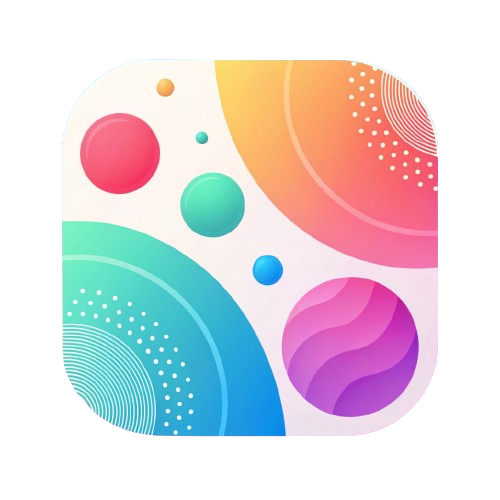

# Zen - Free AI Chat For ALL LLM

<div align="center">



**A powerful VSCode extension that brings AI chat capabilities directly into your development environment**

[](https://github.com/KhanhRomVN/Zen)
[](LICENSE)
[](https://code.visualstudio.com/)

</div>

## 📖 Overview

**Zen** is a feature-rich VSCode extension that integrates AI chat functionality directly into your development workflow. Chat with multiple LLM providers, manage conversation history, and leverage powerful file operations - all without leaving your editor.

## ✨ Key Features

### 🤖 Multi-LLM Support
- Connect to multiple AI providers and models
- Switch between different LLM providers seamlessly
- Flexible configuration for custom endpoints

### 💬 Advanced Chat Interface
- Clean, intuitive chat panel integrated into VSCode sidebar
- Real-time streaming responses
- Syntax-highlighted code blocks with copy functionality
- Collapsible prompt sections for better readability

### 📁 File Operations
- **Read Files**: AI can read and analyze your project files
- **Write Files**: Create new files with AI-generated content
- **Replace Content**: Smart content replacement in existing files
- **Search Files**: Find files across your workspace
- **List Files**: Browse directory structures

### 🔖 Checkpoint System
- **Visual Checkpoints**: Track file modifications with visual markers
- **Diff View**: Compare current state with checkpoint content
- **Revert Capability**: Easily revert changes to previous states
- **Action Tracking**: Each checkpoint tracks the action that created it

### 📜 Conversation Management
- **History Panel**: Browse and load previous conversations
- **Metadata Tracking**: View provider, timestamps, and context size
- **Conversation Cards**: Rich preview cards with conversation details
- **New Chat**: Start fresh conversations anytime

### 🎨 Developer Experience
- **Theme Aware**: Automatically adapts to VSCode theme
- **Keyboard Shortcuts**: Efficient navigation and actions
- **Context Menu Integration**: Quick access to Zen features
- **System Information**: Automatic OS and environment detection

## 🚀 Getting Started

### Installation

1. **From VSIX File**:
   ```bash
   code --install-extension zen-1.0.0.vsix
   ```

2. **From Source**:
   ```bash
   git clone https://github.com/KhanhRomVN/Zen.git
   cd Zen
   npm install
   npm run compile
   ```

### First Time Setup

1. Open VSCode
2. Click on the Zen icon in the Activity Bar (sidebar)
3. Click the Settings icon (⚙️) to configure your AI provider
4. Enter your API credentials
5. Start chatting!

## 🎯 Usage

### Opening Zen Chat

- **Via Activity Bar**: Click the Zen icon in the sidebar
- **Via Command Palette**: `Ctrl+Shift+P` → "Zen: Open Chat"

### Chat Interface

The chat panel includes three main sections accessible via toolbar icons:

- **💬 Chat**: Main conversation interface
- **⚙️ Settings**: Configure AI providers and preferences
- **📜 History**: Browse and load previous conversations

### Using File Operations

When chatting with the AI, you can request file operations:

```
"Read the contents of src/extension.ts"
"Create a new file called utils.ts with helper functions"
"Replace the function handleMessage in ChatPanel.tsx"
```

The AI will present action buttons that you can click to execute the operations.

### Checkpoint System

After file modifications:
1. A checkpoint divider appears: `📍 CHECKPOINT [🗎] [↶]`
2. Click **🗎** to view diff (current vs. checkpoint)
3. Click **↶** to revert changes
4. After reverting, the action button reappears for re-execution

## ⚙️ Configuration

### Settings Panel

Access via the Settings icon (⚙️) in the Zen chat panel:

- **Provider Selection**: Choose your AI provider
- **Model Configuration**: Select and configure models
- **API Credentials**: Securely store API keys
- **Container Settings**: Configure request containers
- **Context Settings**: Adjust context window size

### WebSocket Configuration

Zen uses WebSocket for real-time communication. The extension automatically:
- Finds an available port
- Starts the WebSocket server
- Handles reconnection on failures

## 🏗️ Architecture

### Extension Components

```
Zen/
├── src/
│   ├── extension.ts              # Main extension entry point
│   ├── agent/                    # Agent capability management
│   ├── context/                  # Context building and management
│   ├── core/                     # Core services (WebSocket, state)
│   └── webview-ui/              # React-based UI
│       ├── components/
│       │   ├── ChatPanel/       # Main chat interface
│       │   ├── SettingsPanel/   # Configuration UI
│       │   └── HistoryPanel/    # Conversation history
│       └── services/            # API and storage services
```

### Key Technologies

- **Frontend**: React + TypeScript
- **Backend**: Node.js + VSCode Extension API
- **Communication**: WebSocket (ws library)
- **Build**: Webpack + TypeScript compiler

## 🔧 Development

### Prerequisites

- Node.js 20.x or higher
- VSCode 1.50.0 or higher
- npm or yarn

### Build Commands

```bash
# Install dependencies
npm install

# Compile extension
npm run compile

# Watch mode (development)
npm run watch

# Package for production
npm run package

# Run tests
npm test

# Lint code
npm run lint
```

### Project Structure

- `src/extension.ts`: Extension activation and command registration
- `src/webview-ui/`: React application for the UI
- `webpack.config.js`: Webpack configuration for bundling
- `tsconfig.json`: TypeScript configuration

## 🤝 Contributing

Contributions are welcome! Please feel free to submit a Pull Request.

1. Fork the repository
2. Create your feature branch (`git checkout -b feature/AmazingFeature`)
3. Commit your changes (`git commit -m 'Add some AmazingFeature'`)
4. Push to the branch (`git push origin feature/AmazingFeature`)
5. Open a Pull Request

## 📝 License

This project is licensed under the MIT License - see the [LICENSE](LICENSE) file for details.

## 🙏 Acknowledgments

- Built with [VSCode Extension API](https://code.visualstudio.com/api)
- UI powered by [React](https://reactjs.org/)
- WebSocket communication via [ws](https://github.com/websockets/ws)

## 📧 Contact

**KhanhRomVN** - [@KhanhRomVN](https://github.com/KhanhRomVN)

Project Link: [https://github.com/KhanhRomVN/Zen](https://github.com/KhanhRomVN/Zen)

---

<div align="center">
Made with ❤️ by KhanhRomVN
</div>
